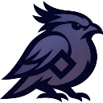

# Nighthawk

<div align="center">

</div>

Nighthawk is a Python library where Python controls flow and LLMs or coding agents reason within constrained Natural blocks.

- **Hard control** (Python code): strict procedure, verification, and deterministic flow.
- **Soft reasoning** (an LLM or coding agent): semantic interpretation inside small embedded "Natural blocks".

The same mechanism handles lightweight LLM judgments ("classify this sentiment") and autonomous agent executions ("refactor this module and write tests").

```py
import nighthawk as nh

def python_average(numbers):
    return sum(numbers) / len(numbers)

step_executor = nh.AgentStepExecutor.from_configuration(
    configuration=nh.StepExecutorConfiguration(model="openai-responses:gpt-5.4-nano")
)

with nh.run(step_executor):

    @nh.natural_function
    def calculate_average(numbers):
        """natural
        Map each element of <numbers> to the number it represents,
        then compute <:result> by calling <python_average> with the mapped list.
        """
        return result

    calculate_average([1, "2", "three", "cuatro"])  # 2.5
```

The LLM interprets the mixed-format input list via `<numbers>`, calls the Python function `<python_average>` through a binding, and commits the result into `<:result>`. Python controls the flow; the LLM handles the semantic interpretation. Binding functions like `<python_average>` appear in the prompt as a single signature line, giving the LLM type-safe composability with no JSON Schema overhead. See **[Philosophy](philosophy.md)** for the full design rationale.

## Getting started

- **[Quickstart](quickstart.md)** -- Setup and first example. Start here.
- **[Natural blocks](natural-blocks.md)** -- Learn what Natural blocks are: bindings, functions, writing guidelines, and binding function design.
- **[Executors](executors.md)** -- Choose an execution backend: Pydantic AI provider, coding agent, or custom.

## Patterns and verification

- **[Patterns](patterns.md)** -- Apply Natural blocks in real workflows: outcomes, deny frontmatter, async, cross-block composition, resilience.
- **[Verification](verification.md)** -- Mock tests, integration tests, prompt inspection, and OpenTelemetry tracing.

## Configuration

- **[Pydantic AI providers](pydantic-ai-providers.md)** -- Provider-specific installation, model identifiers, credentials, and model settings.
- **[Coding agent backends](coding-agent-backends.md)** -- Claude Code and Codex backend configuration, skills, and MCP tool exposure.
- **[Runtime configuration](runtime-configuration.md)** -- Scoping, configuration patching, context limits, and execution identity.

## Reference

- **[Specification](specification.md)** -- Canonical specification (target behavior for implementation).
- **[API Reference](api.md)** -- Auto-generated API documentation from source docstrings.
- **[For coding agents](for-coding-agents.md)** -- Condensed, decision-oriented development reference for coding agents (LLMs) building Python projects with Nighthawk.

## Background and project

- **[Philosophy](philosophy.md)** -- Design rationale: execution model, harness evidence, design consequences (resilience, scoped execution contexts, tool exposure, multi-agent coordination, tradeoffs), runtime evaluation rationale, and design landscape.
- **[Roadmap](roadmap.md)** -- Future directions and open questions.

## Origins

Nighthawk is a compact reimplementation of the core ideas of [Nightjar](https://github.com/psg-mit/nightjarpy).
